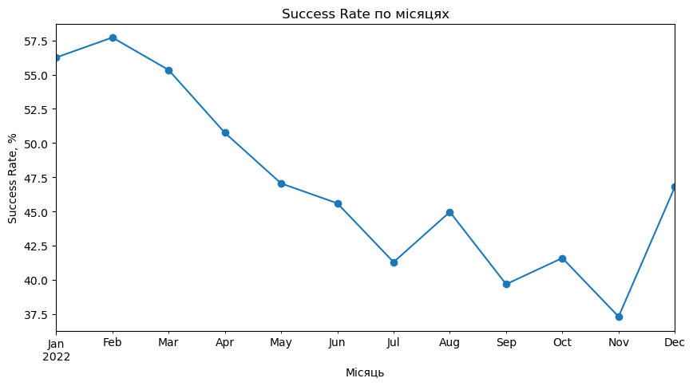
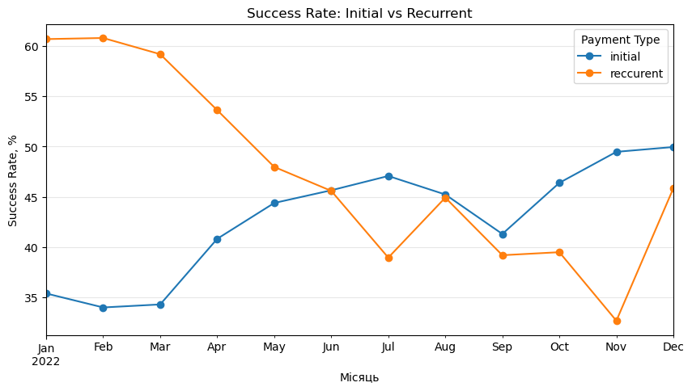
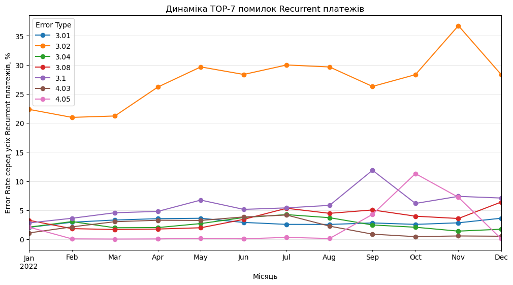
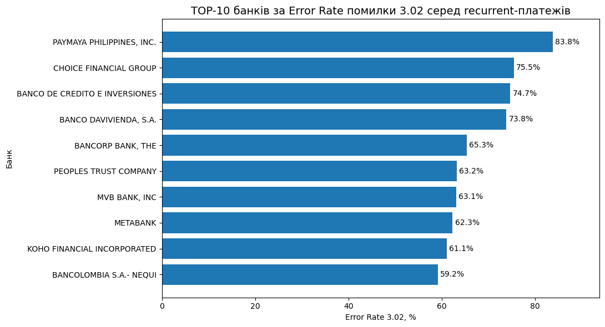
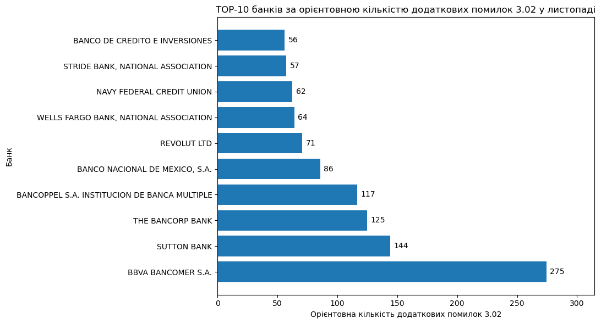
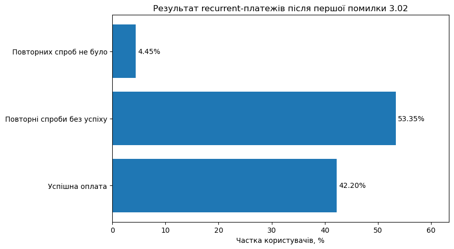

# 💳 Payment Analytics 2022

<p align="center">
  <strong>Аналіз платіжного домену за 2022 рік: Data Quality, ключові KPI, динаміка Payment Success Rate, recurrent-платежі, причини відмов, bank-level аналіз та customer impact помилки 3.02.</strong>
</p>

<p align="center">
  <a href="https://djon-sql.github.io/payment-analytics-2022/"><b>🌐 Відкрити Web Report</b></a>
  &nbsp;•&nbsp;
  <a href="./Payment_Analytics_2022.ipynb"><b>📓 Відкрити Jupyter Notebook</b></a>
</p>


<p align="center">

</p>

---

## 🔎 Про проєкт

Мета проєкту — провести річний огляд платіжного домену, знайти ключові тренди та проблемні зони, визначити основні причини невдалих платежів і сформувати практичні рекомендації для покращення платіжного процесу.

Аналіз побудований як послідовний investigation flow:

**Data Quality → KPI → Success Rate → Initial vs Recurrent → Error Analysis → Bank Analysis → Customer Impact → Business Recommendations**

### Проєкт у цифрах

| Показник | Значення |
|---|---:|
| Платіжні спроби після очищення | **565 315** |
| Унікальні користувачі | **115 245** |
| Успішні платежі | **251 391** |
| Невдалі платежі | **313 924** |
| Payment Success Rate | **44.47%** |
| Payment Fail Rate | **55.53%** |
| Користувачі, які зіткнулися з `3.02` | **25 987** |

---

## 🧭 Навігація по повному аналізу

Нижче можна одразу перейти до потрібного блоку у **Web Report**.

| Розділ | Що досліджується | Перейти |
|---|---|---|
| 🧹 Data Quality | типи даних, дублікати, пропуски, період | [Відкрити →](https://djon-sql.github.io/payment-analytics-2022/#data-quality) |
| 📊 KPI | загальний обсяг, користувачі, Success / Fail Rate | [Відкрити →](https://djon-sql.github.io/payment-analytics-2022/#kpi) |
| 📉 Success Rate | місячна динаміка успішності платежів | [Відкрити →](https://djon-sql.github.io/payment-analytics-2022/#success-rate) |
| 🔁 Initial vs Recurrent | динаміка двох типів платежів та їх частка | [Відкрити →](https://djon-sql.github.io/payment-analytics-2022/#initial-vs-recurrent) |
| ⚠️ Recurrent Failures | структура кодів помилок | [Відкрити →](https://djon-sql.github.io/payment-analytics-2022/#recurrent-failures) |
| 🧩 Error Analysis | Error Rate кодів серед усіх recurrent-спроб | [Відкрити →](https://djon-sql.github.io/payment-analytics-2022/#error-analysis) |
| 🏦 Bank Analysis | детальний аналіз `3.02` за банками | [Відкрити →](https://djon-sql.github.io/payment-analytics-2022/#bank-analysis) |
| 👤 Customer Impact | поведінка користувачів після першої `3.02` | [Відкрити →](https://djon-sql.github.io/payment-analytics-2022/#customer-impact) |
| 💡 Висновки | ключові результати дослідження | [Відкрити →](https://djon-sql.github.io/payment-analytics-2022/#conclusions) |
| ✅ Рекомендації | практичні кроки для бізнесу | [Відкрити →](https://djon-sql.github.io/payment-analytics-2022/#recommendations) |

---

## 🎯 Бізнес-питання

У межах проєкту я намагався відповісти на такі питання:

- Як змінювався **Payment Success Rate** протягом 2022 року?
- Чи однаково поводяться `initial` та `recurrent` платежі?
- Який тип платежів найбільше пов'язаний із погіршенням загального результату?
- Які коди помилок формують основну частину recurrent failures?
- Які помилки найбільше пов'язані з проблемними місяцями?
- Наскільки значущою є помилка `3.02`?
- Чи концентрується `3.02` у конкретних банках або періодах?
- Що відбувається з користувачами після першої recurrent-помилки `3.02`?

---

## 🗂️ Дані

Початковий набір містив платіжні транзакції за повний 2022 рік.

<details>
<summary><b>Показати поля датасету</b></summary>

| Поле | Опис |
|---|---|
| `order_id` | ідентифікатор платіжного ордера |
| `event_time` | дата та час транзакції |
| `user_id` | ідентифікатор користувача |
| `price` | сума платежу |
| `payment_number` | тип платежу: `initial` / `reccurent` |
| `transaction_status` | статус: `success` / `fail` |
| `card_brand` | бренд картки |
| `card_type` | тип картки |
| `bank_name` | банк-емітент |
| `error_type` | код помилки |
| `currency` | валюта платежу |
| `card_country` | країна банку-емітента |

> У вихідних даних категорія recurrent записана як `reccurent`. У коді збережено фактичне значення з датасету, а в тексті використовується звичне написання **recurrent**.

</details>

[🔎 Перейти до Data Quality у Web Report](https://djon-sql.github.io/payment-analytics-2022/#data-quality)

---

## 🧹 1. Data Quality та очищення

Перед бізнес-аналізом було перевірено структуру, типи даних, період, пропуски та дублікати.

### Що було виявлено

- початковий розмір — **566 413 рядків × 13 колонок**;
- технічна колонка `#` була унікальною для кожного рядка та маскувала повні дублікати;
- після її видалення знайдено **1 098 повних дублікатів**;
- після очищення залишилося **565 315 рядків × 12 колонок**;
- `event_time` перетворено у datetime;
- дані покривають повний 2022 рік.

### Пропуски після очищення

| Поле | Пропуски | Частка |
|---|---:|---:|
| `card_type` | 770 | ~0.14% |
| `bank_name` | 2 006 | ~0.35% |
| `error_type` | 252 297 | ~44.63% |
| `card_country` | 527 | ~0.09% |

Висока частка `NaN` у `error_type` переважно пояснюється логікою даних: серед успішних платежів код помилки майже завжди відсутній. Серед `fail` без коду залишилося лише **907 операцій (~0.29%)**.

Також виявлено **1 успішну транзакцію з кодом `4.03`** — поодинокий виняток, який не має суттєвого впливу на загальну картину.

👉 [Повний блок Data Quality](https://djon-sql.github.io/payment-analytics-2022/#data-quality)

---

## 📊 2. Ключові KPI

Після очищення було сформовано базовий зріз платіжного домену.

| KPI | Значення |
|---|---:|
| Платіжні спроби | **565 315** |
| Унікальні користувачі | **115 245** |
| Успішні платежі | **251 391** |
| Невдалі платежі | **313 924** |
| Payment Success Rate | **44.47%** |
| Payment Fail Rate | **55.53%** |

Понад половина всіх платіжних спроб завершилась відмовою. Тому наступний крок — подивитися, **як цей показник змінювався протягом року і де саме формувалось погіршення**.

👉 [Відкрити KPI у Web Report](https://djon-sql.github.io/payment-analytics-2022/#kpi)

---

## 📉 3. Динаміка Payment Success Rate



### Ключові спостереження

- січень — **56.25%**;
- максимум року — **57.71% у лютому**;
- далі спостерігається загальна низхідна динаміка;
- мінімум — **37.32% у листопаді**;
- у грудні показник частково відновився до **46.80%**, але не повернувся до рівня початку року.

Цей тренд став відправною точкою для поділу платежів на `initial` та `recurrent`.

👉 [Повний блок Success Rate](https://djon-sql.github.io/payment-analytics-2022/#success-rate)

---

## 🔁 4. Initial vs Recurrent



Два типи платежів показали **різноспрямовану динаміку**:

- `initial` Success Rate загалом покращувався;
- `recurrent` Success Rate суттєво погіршувався;
- recurrent-платежі формували приблизно **75% платіжного потоку**.

Recurrent SR знизився приблизно з **60–61% на початку року** до **32.68% у листопаді**, після чого зріс до **45.85% у грудні**.

> **Висновок:** загальне падіння Payment Success Rate найбільше пов'язане саме з погіршенням recurrent-потоку, а не лише зі зміною частки initial/recurrent.

👉 [Initial vs Recurrent — повний аналіз](https://djon-sql.github.io/payment-analytics-2022/#initial-vs-recurrent)

---

## ⚠️ 5. Recurrent failures та структура помилок

Після визначення recurrent як основної проблемної частини потоку було проаналізовано коди помилок серед невдалих recurrent-платежів.

Найбільше виділяється код **`3.02`**:

- **121 031** recurrent failures;
- **51.25%** усіх recurrent failures;
- близько **28.61%** усіх recurrent-спроб.

Водночас у різні періоди змінювалися й інші коди — `3.10`, `3.08`, `4.05` тощо. Тому один лише річний рейтинг помилок не пояснює всю динаміку.

👉 [Структура recurrent failures](https://djon-sql.github.io/payment-analytics-2022/#recurrent-failures)

---

## 🧩 6. Error Rate серед усіх recurrent-платежів

Для оцінки реального внеску помилок у recurrent performance важливо дивитися не тільки на їхню частку **серед fail**, а й на частоту **серед усіх recurrent-спроб**.



### Методика

Використано два різні знаменники:

1. **Error share серед recurrent failures** — показує структуру причин відмов;
2. **Error Rate серед усіх recurrent attempts** — показує внесок конкретної помилки в загальний recurrent-потік.

Другий показник зіставлявся з місячною динамікою recurrent Success Rate.

Аналіз показав, що **немає одного універсального коду, який однаково пояснює всі місяці падіння**, але `3.02` особливо виділявся у квітні, травні та листопаді.

👉 [Повний Error Analysis](https://djon-sql.github.io/payment-analytics-2022/#error-analysis)

---

## 🏦 7. Bank-level аналіз помилки 3.02

Після цього `3.02` було деталізовано за банками.

Для річного порівняння враховувались банки з **не менше ніж 500 recurrent-платежів**, щоб зменшити вплив дуже малих груп.



### Що враховувалось

- recurrent volume;
- кількість `3.02`;
- Error Rate `3.02`;
- зміна Error Rate місяць до місяця;
- обсяг платежів, на якому відбулася ця зміна.

Ключовий момент: **високий Error Rate на малому обсязі не обов'язково має більший бізнес-вплив, ніж невелике зростання Error Rate у великого банку**.

### Листопад: орієнтовні додаткові 3.02

Для цього використано показник `additional_302` — оцінку кількості додаткових `3.02` порівняно зі сценарієм, у якому Error Rate залишився на рівні попереднього місяця при поточному обсязі.



У листопаді найбільшу орієнтовну оцінку мав **BBVA BANCOMER S.A. — близько 275 додаткових `3.02`**. Також виділялися **SUTTON BANK**, **THE BANCORP BANK** та **BANCOPPEL**.

При цьому склад проблемних банків змінювався в різні місяці: **жоден банк не входив до TOP-10 одночасно у квітні, травні та листопаді**.

> `additional_302` — це аналітична оцінка на основі зміни Error Rate та обсягу, а не доказ причинно-наслідкового зв'язку.

👉 [Повний Bank Analysis](https://djon-sql.github.io/payment-analytics-2022/#bank-analysis)

---

## 👤 8. Customer Impact після першої 3.02

Помилка `3.02` зачепила **25 987 унікальних користувачів**.

Для кожного користувача було визначено перший момент появи `3.02`, після чого проаналізовано всі наступні recurrent-платежі у доступних даних.



| Результат після першої `3.02` | Користувачі | Частка |
|---|---:|---:|
| Надалі був хоча б 1 успішний recurrent-платіж | **10 967** | **42.20%** |
| Були повторні recurrent-спроби, але без успіху | **13 864** | **53.35%** |
| Подальших recurrent-спроб у даних не було | **1 156** | **4.45%** |

Найбільша група — користувачі, які **продовжували recurrent-спроби, але не мали успішного платежу після першої `3.02`**.

Також **7 289 користувачів отримали `3.02` рівно п'ять разів**, що робить retry-логіку окремим важливим напрямом для подальшого дослідження.

> Важливо: наступний успішний recurrent-платіж не обов'язково є retry того самого `order_id`, а відсутність наступної recurrent-спроби в межах датасету не означає churn користувача.

👉 [Customer Impact — повний блок](https://djon-sql.github.io/payment-analytics-2022/#customer-impact)

---

## 💡 Основні висновки

1. Загальний **Payment Success Rate — 44.47%**, тобто понад половина спроб завершилась відмовою.
2. Протягом року успішність платежів погіршувалась: від рівня понад 55% на початку року до **37.32% у листопаді**.
3. Основне погіршення спостерігалось у **recurrent-платежах**, які одночасно формували приблизно 75% потоку.
4. Код **`3.02`** був найбільш поширеним recurrent failure — **51.25%** усіх recurrent-відмов.
5. Один код не пояснює всю негативну динаміку: у різні місяці зростали різні типи помилок.
6. Bank-level драйвери змінювалися протягом року, тому статичного річного рейтингу недостатньо для операційного моніторингу.
7. Customer impact помилки `3.02` суттєвий: після першої `3.02` лише **42.20%** користувачів надалі мали хоча б один успішний recurrent-платіж у межах доступних даних.

👉 [Відкрити фінальні висновки у Web Report](https://djon-sql.github.io/payment-analytics-2022/#conclusions)

---

## ✅ Практичні рекомендації

На основі результатів аналізу:

1. **Моніторити initial та recurrent окремо** — Success Rate, обсяг і частку кожного типу платежів.
2. **Винести `3.02` в окремий операційний моніторинг**, особливо у періоди різкого погіршення recurrent SR.
3. **Використовувати bank-level alerts**, поєднуючи Error Rate з обсягом платежів, а не дивитися лише на відсоток помилки.
4. **Перевірити retry-логіку**, особливо сценарії з повторенням `3.02` п'ять разів.
5. **Окремо аналізувати користувачів із повторними відмовами без подальшого успіху** та коди їхніх наступних помилок.
6. **Нормалізувати `bank_name` на рівні джерела або довідника**, щоб підвищити точність bank-level моніторингу.

👉 [Відкрити всі рекомендації](https://djon-sql.github.io/payment-analytics-2022/#recommendations)

---

## 🛠️ Інструменти та навички

- **Python**
- **Pandas**
- **NumPy**
- **Matplotlib**
- **Jupyter Notebook**
- Data Cleaning & Data Quality
- GroupBy / Aggregations / Pivot Tables
- Time Series Analysis
- KPI & Error Rate Analysis
- Customer Behavior Analysis
- Data Visualization
- Business Interpretation

---

## 📁 Структура репозиторію

```text
payment-analytics-2022/
├── Payment_Analytics_2022.ipynb   # повний аналіз, код і результати
├── index.html                     # web-версія для GitHub Pages
├── README.md                      # презентація проєкту
└── assets/
    ├── 01_monthly_success_rate.png
    ├── 02_initial_vs_recurrent.png
    ├── 03_recurrent_error_rate.png
    ├── 04_top_banks_302.png
    ├── 05_additional_302_november.png
    └── 06_customer_impact_302.png
```

---

## ▶️ Як переглянути проєкт

### 🌐 Web Report — рекомендований варіант

**https://djon-sql.github.io/payment-analytics-2022/**

Веб-версія містить повний notebook: Markdown-пояснення, код, таблиці, графіки та висновки без необхідності запускати Jupyter.

### 📓 Jupyter Notebook

[Відкрити `Payment_Analytics_2022.ipynb`](./Payment_Analytics_2022.ipynb)

### 💻 Локальний запуск

1. Додати `test_payment_data.csv` у ту саму папку, що й notebook.
2. Встановити залежності:

```bash
pip install pandas numpy matplotlib jupyter
```

3. Запустити Jupyter:

```bash
jupyter notebook
```

> CSV-файл не публікується у цьому репозиторії. Для локального `Run All` датасет потрібно додати окремо.

---

## ⚠️ Обмеження та методологічні примітки

- `error_type` розглядається як **категоріальний код**, а не числова величина.
- Різниця між процентними показниками описується у **процентних пунктах (п.п.)**.
- `bank_name` не проходив повну нормалізацію, тому один банк може бути представлений декількома варіантами назви.
- `additional_302` є **орієнтовною аналітичною оцінкою**, а не причинною оцінкою.
- Customer Impact описує подальшу recurrent-поведінку користувача після першої `3.02`, а не обов'язково retry тієї самої транзакції.
- Відсутність наступної recurrent-спроби у межах датасету не означає, що користувач повністю припинив користуватися продуктом.
- Користувачі, які вперше отримали `3.02` наприкінці року, мали коротший період для спостереження подальшої поведінки.

---

## 🔗 Посилання

- 🌐 **Live Web Report:** https://djon-sql.github.io/payment-analytics-2022/
- 📓 **Jupyter Notebook:** [Payment_Analytics_2022.ipynb](./Payment_Analytics_2022.ipynb)
- 💻 **GitHub Repository:** https://github.com/djon-sql/payment-analytics-2022

---

## 👤 Автор

**Dmytro Kupriyanov**  
Junior Data Analyst  
GitHub: [@djon-sql](https://github.com/djon-sql)
