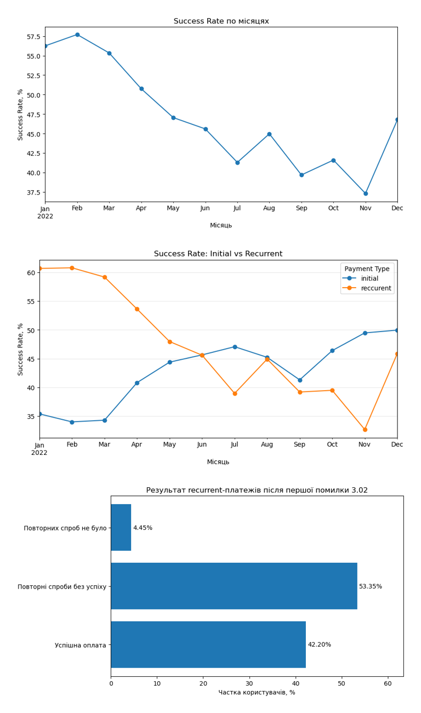

# 💳 Payment Analytics 2022

<p align="center">
  <strong>Аналіз платіжних транзакцій за 2022 рік: якість даних, ключові KPI, Payment Success Rate, recurrent-платежі, помилка 3.02 та її вплив на користувачів.</strong>
</p>

<p align="center">
  <a href="https://djon-sql.github.io/payment-analytics-2022/"><b>🌐 Web Report</b></a> ·
  <a href="./Payment_Analytics_2022.ipynb"><b>📓 Jupyter Notebook</b></a>
</p>

<p align="center">
  
  
  
  
</p>



---

## 📌 Про проєкт

Мета проєкту — дослідити платіжний домен за 2022 рік, виявити ключові тренди та проблемні зони, визначити основні причини невдалих платежів і сформувати практичні рекомендації для покращення платіжного процесу.

У роботі я послідовно пройшов шлях від перевірки якості даних до аналізу бізнес-метрик, причин відмов, bank-level динаміки та поведінки користувачів після помилки `3.02`.

### Швидка навігація по повному аналізу

| Блок | Що всередині | Перейти |
|---|---|---|
| 1. Data Quality | типи даних, дублікати, пропуски, базова перевірка | [Відкрити →](https://djon-sql.github.io/payment-analytics-2022/#data-quality) |
| 2. KPI | загальна кількість спроб, користувачі, Success / Fail Rate | [Відкрити →](https://djon-sql.github.io/payment-analytics-2022/#kpi) |
| 3. Success Rate | місячна динаміка успішності платежів | [Відкрити →](https://djon-sql.github.io/payment-analytics-2022/#success-rate) |
| 4. Initial vs Recurrent | порівняння двох типів платежів і їхньої частки | [Відкрити →](https://djon-sql.github.io/payment-analytics-2022/#initial-vs-recurrent) |
| 5. Recurrent Failures | структура кодів помилок серед невдалих recurrent-платежів | [Відкрити →](https://djon-sql.github.io/payment-analytics-2022/#recurrent-failures) |
| 6. Error Analysis | зв'язок recurrent SR з основними кодами помилок | [Відкрити →](https://djon-sql.github.io/payment-analytics-2022/#error-analysis) |
| 7. Bank Analysis | детальний аналіз `3.02` за банками | [Відкрити →](https://djon-sql.github.io/payment-analytics-2022/#bank-analysis) |
| 8. Customer Impact | поведінка користувачів після першої `3.02` | [Відкрити →](https://djon-sql.github.io/payment-analytics-2022/#customer-impact) |
| 9. Висновки | основні результати дослідження | [Відкрити →](https://djon-sql.github.io/payment-analytics-2022/#conclusions) |
| 10. Рекомендації | практичні кроки на основі аналізу | [Відкрити →](https://djon-sql.github.io/payment-analytics-2022/#recommendations) |

---

## 🎯 Бізнес-питання

У межах проєкту я відповідав на такі питання:

- Як змінювався **Payment Success Rate** протягом 2022 року?
- Який тип платежів більше пов'язаний із погіршенням загального результату — `initial` чи `reccurent`?
- Які коди помилок найчастіше зустрічаються серед recurrent failures?
- Чи можна пов'язати падіння recurrent Success Rate з окремими кодами помилок?
- Наскільки значущою є помилка `3.02`?
- Чи концентрується `3.02` у конкретних банках або проблемних періодах?
- Що відбувається з користувачами після першої recurrent-помилки `3.02`?

---

## 🗂️ Дані

Після очищення в аналізі використано **565 315 платіжних спроб** від **115 245 унікальних користувачів** за 2022 рік.

Основні поля датасету:

| Поле | Значення |
|---|---|
| `order_id` | ідентифікатор операції |
| `event_time` | дата й час операції |
| `user_id` | ідентифікатор користувача |
| `price` | сума платежу |
| `payment_number` | тип платежу: `initial` / `reccurent` |
| `transaction_status` | `success` / `fail` |
| `card_brand` | платіжна система |
| `card_type` | тип картки |
| `bank_name` | банк-емітент |
| `error_type` | код помилки |
| `currency` | валюта |
| `card_country` | країна картки |

> У вихідних даних категорія recurrent записана як `reccurent`; у текстовій частині проєкту використовую звичне написання **recurrent**.

[🔎 Перейти до Data Quality у web report](https://djon-sql.github.io/payment-analytics-2022/#data-quality)

---

## 🧹 1. Data Quality та очищення

Під час первинної перевірки:

- початковий датасет містив **566 413 рядків і 13 колонок**;
- технічна колонка `#` була унікальною для кожного рядка й маскувала повні дублікати;
- після її видалення знайдено **1 098 повних дублікатів**;
- після очищення залишилось **565 315 рядків і 12 аналітичних колонок**;
- `event_time` перетворено у формат datetime;
- дані покривають повний 2022 рік.

### Пропуски після очищення

| Поле | Кількість пропусків | Частка |
|---|---:|---:|
| `card_type` | 770 | ~0.14% |
| `bank_name` | 2 006 | ~0.35% |
| `error_type` | 252 297 | ~44.63% |
| `card_country` | 527 | ~0.09% |

Висока частка `NaN` у `error_type` переважно пояснюється успішними операціями: серед `success` код помилки майже завжди відсутній. Серед `fail` без коду залишилось лише **907 операцій (~0.29%)**. Також знайдено **1 success-транзакцію з кодом 4.03** — поодинокий виняток, який не впливає на загальні результати.

[🔎 Відкрити повний блок Data Quality](https://djon-sql.github.io/payment-analytics-2022/#data-quality)

---

## 📊 2. Ключові KPI

| KPI | Значення |
|---|---:|
| Платіжні спроби | **565 315** |
| Унікальні користувачі | **115 245** |
| Успішні платежі | **251 391** |
| Невдалі платежі | **313 924** |
| Payment Success Rate | **44.47%** |
| Payment Fail Rate | **55.53%** |

Понад половина всіх спроб завершилась відмовою, тому далі аналіз фокусується не тільки на загальному SR, а й на тому, **де саме формується погіршення**.

[🔎 Відкрити KPI у web report](https://djon-sql.github.io/payment-analytics-2022/#kpi)

---

## 📉 3. Динаміка Payment Success Rate


Ключові спостереження:

- у січні Success Rate становив **56.25%**;
- найкращий результат року — **57.71% у лютому**;
- протягом року показник загалом знижувався;
- мінімум — **37.32% у листопаді**;
- у грудні відбулось часткове відновлення до **46.80%**, але рівень початку року не був повернутий.

Цей тренд став відправною точкою для подальшого поділу потоку на initial та recurrent.

[🔎 Відкрити повний блок Success Rate](https://djon-sql.github.io/payment-analytics-2022/#success-rate)

---

## 🔁 4. Initial vs Recurrent


Аналіз показав різноспрямовану динаміку:

- **initial SR** загалом покращувався протягом року;
- **recurrent SR** навпаки суттєво погіршувався;
- recurrent-платежі формували приблизно **75% платіжного потоку**, тому саме їхня динаміка мала найбільший вплив на загальний показник.

Recurrent SR знизився приблизно з **60–61% на початку року** до **32.68% у листопаді**, після чого зріс до **45.85% у грудні**.

> Висновок: загальне падіння Payment Success Rate не пояснюється лише зміною структури initial/recurrent — основна проблема знаходиться всередині recurrent-потоку.

[🔎 Initial vs Recurrent — повний аналіз](https://djon-sql.github.io/payment-analytics-2022/#initial-vs-recurrent)

---

## ⚠️ 5. Recurrent failures та коди помилок

Найчастіший recurrent-код — **`3.02`**:

- **121 031** recurrent failures;
- **51.25%** усіх невдалих recurrent-платежів;
- близько **28.61%** усіх recurrent-спроб.

Водночас аналіз не зводиться лише до `3.02`: у різні місяці помітно змінювались також `3.10`, `3.08`, `4.05` та інші коди.


Для оцінки впливу помилок використано два різні знаменники:

1. **частка серед recurrent failures** — показує структуру причин відмов;
2. **частота серед усіх recurrent-платежів** — показує внесок коду в загальну ефективність recurrent-потоку.

Саме другий підхід використано для зіставлення з Success Rate.

[🔎 Структура recurrent failures](https://djon-sql.github.io/payment-analytics-2022/#recurrent-failures) · [🔎 Error Rate серед усіх recurrent](https://djon-sql.github.io/payment-analytics-2022/#error-rate-all-recurrent)

---

## 🏦 6. Детальний аналіз помилки 3.02 за банками

Для bank-level аналізу враховувались одночасно:

- кількість recurrent-платежів;
- кількість `3.02`;
- Error Rate `3.02`;
- зміна Error Rate місяць до місяця;
- обсяг потоку, на якому виникла зміна.

Щоб зменшити вплив дуже малих груп, у річне порівняння включались банки з **не менше ніж 500 recurrent-платежів**.


Важливий висновок: **найбільша кількість помилок не завжди означає найвищий Error Rate**, тому для пріоритизації проблемних банків необхідно дивитися і на частоту, і на обсяг.

### Листопад: оцінка додаткових 3.02

Показник `additional_302` оцінює, скільки додаткових помилок могло виникнути порівняно зі сценарієм, у якому Error Rate залишився на рівні попереднього місяця.


У листопаді найбільшу орієнтовну оцінку мав **BBVA BANCOMER S.A. — близько 275 додаткових 3.02**. Також виділялися **SUTTON BANK**, **THE BANCORP BANK** та **BANCOPPEL**.

Склад проблемних банків змінювався від місяця до місяця: **жоден банк не входив до TOP-10 одночасно у квітні, травні та листопаді**.

> `additional_302` — аналітична оцінка на основі зміни Error Rate та поточного обсягу, а не доказ причинно-наслідкового зв'язку.

[🔎 Повний bank-level аналіз](https://djon-sql.github.io/payment-analytics-2022/#bank-analysis) · [🔎 Листопадний additional_302](https://djon-sql.github.io/payment-analytics-2022/#additional-302-november)

---

## 👤 7. Customer Impact після першої 3.02

Помилка `3.02` зачепила **25 987 унікальних користувачів**.

Окремо було проаналізовано recurrent-платежі, які відбувалися **після першої 3.02** для кожного користувача.


| Результат після першої 3.02 | Користувачі | Частка |
|---|---:|---:|
| Надалі був хоча б 1 успішний recurrent-платіж | **10 967** | **42.20%** |
| Були повторні recurrent-спроби, але без успіху | **13 864** | **53.35%** |
| Подальших recurrent-спроб у даних не було | **1 156** | **4.45%** |

Найбільша група — користувачі, які **продовжували повторні спроби, але не мали успішного recurrent-платежу після першої 3.02**.

Додатково виявлено, що **7 289 користувачів отримали 3.02 рівно п'ять разів**, що робить логіку повторних спроб окремим напрямом для подальшого дослідження.

> Важливо: наступний успішний recurrent-платіж не обов'язково є повтором того самого `order_id`, а відсутність наступної recurrent-спроби в межах датасету не означає churn користувача.

[🔎 Customer Impact — повний блок](https://djon-sql.github.io/payment-analytics-2022/#customer-impact) · [🔎 Підсумок результатів](https://djon-sql.github.io/payment-analytics-2022/#customer-outcomes)

---

## 💡 Основні висновки

1. **Понад половина спроб завершилась відмовою.** Загальний Success Rate — **44.47%**.
2. **Успішність платежів протягом року погіршувалась:** від рівня понад 55% на початку року до мінімуму **37.32% у листопаді**.
3. **Головне погіршення спостерігалось у recurrent-платежах**, які при цьому формували більшість потоку.
4. **Код `3.02` був найбільш поширеним recurrent failure** — **51.25%** відмов.
5. **Один код не пояснює всю негативну динаміку:** у різні періоди зростали різні типи помилок.
6. **Bank-level драйвери змінювались протягом року**, тому моніторинг потрібно вести динамічно, а не лише за річним рейтингом.
7. **Customer impact суттєвий:** після першої `3.02` лише **42.20%** користувачів надалі мали хоча б один успішний recurrent-платіж у межах доступних даних.

[🔎 Відкрити фінальні висновки](https://djon-sql.github.io/payment-analytics-2022/#conclusions)

---

## ✅ Рекомендації

На основі результатів аналізу:

1. **Моніторити initial і recurrent окремо** — SR, обсяг і частку кожного типу.
2. **Пріоритезувати дослідження `3.02`** разом із платіжною командою та відстежувати її динаміку в проблемні місяці.
3. **Контролювати bank-level зміни** з урахуванням одночасно Error Rate та обсягу платежів.
4. **Перевірити retry-логіку**, особливо сценарій, у якому користувачі отримують `3.02` рівно п'ять разів.
5. **Окремо аналізувати користувачів із повторними відмовами без подальшого успіху**, включно з кодами їхніх наступних помилок.

[🔎 Відкрити всі рекомендації](https://djon-sql.github.io/payment-analytics-2022/#recommendations)

---

## 🛠️ Інструменти та навички

- **Python**
- **Pandas**
- **Matplotlib**
- **Jupyter Notebook**
- Data Cleaning & Data Quality
- GroupBy / Aggregations / Pivot Tables
- Time Series Analysis
- KPI & Error Rate Analysis
- Customer Behavior Analysis
- Data Visualization
- Business Interpretation

---

## 📁 Структура репозиторію

```text
payment-analytics-2022/
├── Payment_Analytics_2022.ipynb   # повний аналіз, код і результати
├── index.html                     # web-версія проєкту для GitHub Pages
├── README.md                      # презентація проєкту
└── assets/
    ├── project_overview.png
    ├── 01_monthly_success_rate.png
    ├── 02_initial_vs_recurrent.png
    ├── 03_recurrent_error_rate.png
    ├── 04_top_banks_302.png
    ├── 05_additional_302_november.png
    └── 06_customer_impact_302.png
```

---

## ▶️ Як переглянути проєкт

### Найзручніше — Web Report

👉 **https://djon-sql.github.io/payment-analytics-2022/**

Web-версія містить усі Markdown-пояснення, код, таблиці, графіки та висновки без необхідності запускати Jupyter.

### Jupyter Notebook

👉 [Payment_Analytics_2022.ipynb](./Payment_Analytics_2022.ipynb)

### Локальний запуск

1. Покласти `test_payment_data.csv` у ту саму папку, що й notebook.
2. Встановити залежності:

```bash
pip install pandas matplotlib jupyter
```

3. Запустити:

```bash
jupyter notebook
```

> Сам CSV-файл не публікується в цьому репозиторії; для локального `Run All` його потрібно додати окремо.

---

## ⚠️ Методологічні примітки

- `error_type` розглядається як **категоріальний код**, а не числова величина.
- Різниця між процентними показниками описується у **процентних пунктах (п.п.)**.
- Bank-level висновки формуються на основі значень `bank_name`, наявних у датасеті; повна нормалізація назв банків не була окремим етапом аналізу.
- `additional_302` використовується як **орієнтовний аналітичний показник**, а не як причинна оцінка.
- Customer Impact описує подальші recurrent-операції користувача після першої `3.02`, а не обов'язково retry тієї самої транзакції.

---

## 🔗 Посилання

- 🌐 **Live Web Report:** https://djon-sql.github.io/payment-analytics-2022/
- 📓 **Jupyter Notebook:** [Payment_Analytics_2022.ipynb](./Payment_Analytics_2022.ipynb)
- 💻 **GitHub Repository:** https://github.com/djon-sql/payment-analytics-2022

---

## 👤 Автор

**Dmytro Kupriyanov**  
Junior Data Analyst  
GitHub: [@djon-sql](https://github.com/djon-sql)
